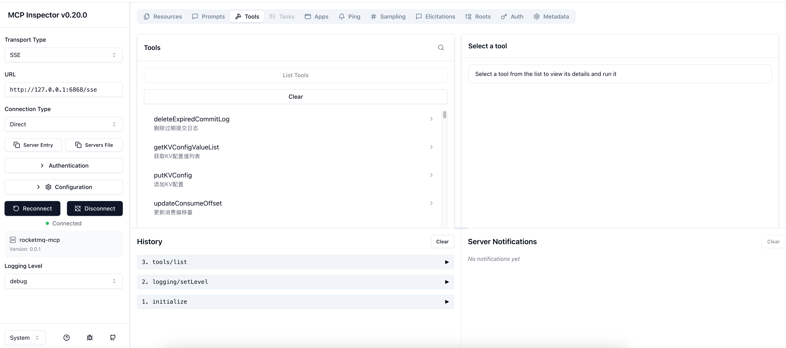

# RocketMQ MCP Server

基于Spring Boot的RocketMQ MCP服务器，提供RocketMQ管理功能的HTTP接口。

## 项目结构

```
rocketmq-mcp/
├── src/                         # Java源代码
│   └── main/java/org/apache/rocketmq/mcp/
│       ├── Startup.java         # 启动类
│       ├── ToolsLoader.java     # 工具加载器
│       ├── common/              # 通用工具类
│       ├── spring/              # Spring配置
│       └── tool/                # RocketMQ AI Agent Tools
├── test/                        # Python测试脚本和工具
│   ├── README.md               # 测试目录说明
│   ├── requirements.txt        # Python依赖
│   ├── TESTING.md              # 详细测试指南
│   ├── test_rocketmq_mcp_unittest.py # unittest版本
│   ├── demo_unittest.py        # unittest演示
│   └── run_unittest.sh         # unittest运行脚本
├── pom.xml                     # Maven配置
├── build.sh                    # 构建脚本
└── README.md                   # 本文件
```

## 快速开始

### 1. 构建项目

```bash
./build.sh
```

### 2. 运行服务器

```bash
java -jar target/rocketmq-mcp-*.jar
```

服务器将在端口6868启动。

### 3. 测试接口

所有测试脚本和工具都在 `test/` 目录中。请查看 [test/README.md](test/README.md) 获取详细的使用说明。

## API接口

服务器提供以下RocketMQ管理功能的HTTP接口：

### Controller接口

- `POST /controller/getControllerConfig` - 获取控制器配置
- `POST /controller/updateControllerConfig` - 更新控制器配置

### Nameserver接口

- `POST /nameserver/getNameServerAddressList` - 获取NameServer地址列表
- `POST /nameserver/getKVConfig` - 获取KV配置

### Message接口

- `POST /message/viewMessage` - 查询消息

### Broker接口

- `POST /broker/getBrokerRuntimeStats` - 获取Broker运行时统计

### ACL接口

- `POST /acl/getAclVersionList` - 获取ACL版本列表

### Consumer接口

- `POST /consumer/examineConsumerConnectionInfo` - 获取消费者连接信息

### Topic接口

- `POST /topic/topicList` - 获取Topic列表

### Cluster接口

- `POST /cluster/clusterList` - 获取集群信息

### Producer接口

- `POST /producer/examineProducerConnectionInfo` - 获取生产者连接信息

### ConsumeQueue接口

- `POST /consumequeue/examineConsumeQueue` - 获取消费队列信息

## 测试说明

所有Python测试脚本和工具都集中在 `test/` 目录中：

- **标准测试脚本** - 自定义测试框架，生成详细JSON报告
- **unittest版本** - 使用Python标准测试框架，适合CI/CD集成
- **演示脚本** - 展示测试框架的各种功能
- **运行脚本** - 简化测试执行过程

详细的使用说明请查看：[test/README.md](test/README.md)

## 配置说明

服务器配置在 `src/main/resources/application.properties` 中：

```properties
server.port=6868
spring.application.name=rocketmq-mcp
```

## 依赖管理

- **Java依赖**: Maven管理，详见 `pom.xml`
- **Python测试依赖**: 详见 `test/requirements.txt`

## 开发说明

### 添加新的工具类

1. 在 `src/main/java/org/apache/rocketmq/mcp/tool/` 目录下创建新的工具类
2. 实现相应的HTTP接口
3. 在 `ToolsLoader.java` 中注册新的工具类
4. 在 `test/` 目录中添加相应的测试用例

### 扩展测试

1. 在标准测试脚本中添加新的测试方法
2. 在unittest版本中添加相应的测试方法
3. 更新演示脚本展示新功能
4. 更新测试文档说明新的测试范围

### 本地调试
1. 启动mcp 调试工具
```shell
sh mcp_inspector.sh
```

2. 输入本地mcp地址信息

